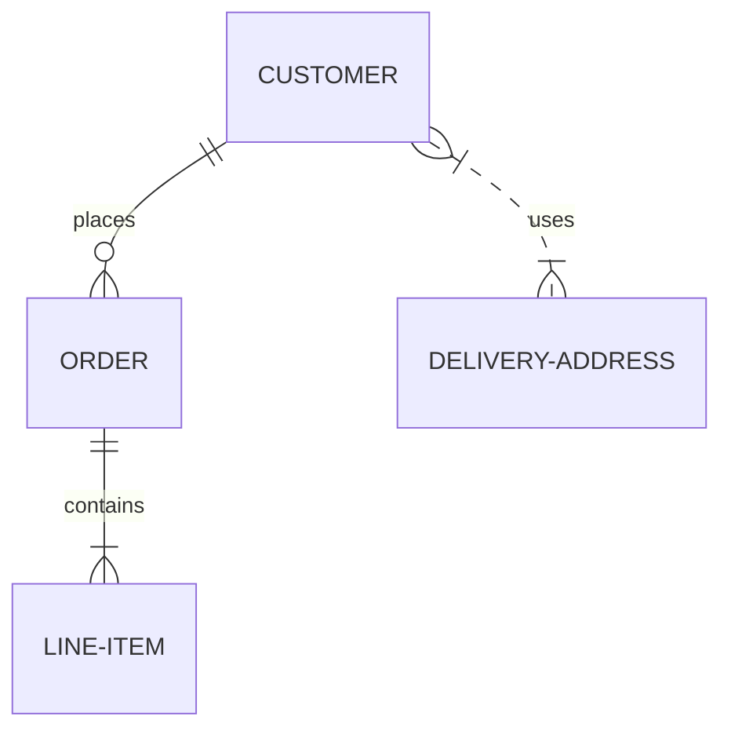

#SQL
# RDB - Řízení databází

## Literatura
- [pavel.tyl/DBS](http://dom.mti.tul.cz/~pavel.tyl/DBS/DBS2019/Modelovani/aDbC.htm)
- [mermaid ER](https://mermaid.js.org/syntax/entityRelationshipDiagram.html)

## Zápočet
Projekt ve skupině až 3 lidí.
[[Zadání semestrální práce|Zadání]] semestrální práce.

Prezentace
20-30 minut
- [[Témata prezentací]]

## Zkouška
Na papír, praktický návrh Databáze (SQL).

## Cvičení
- [[cv03_Pivovary]]

## Poznámky
> [!quote] P2P - Peer to Peer (Torrent), když máte hodně nodů a vy jich máte, tak to nejde zničit.
> \- Roman Špánek

Školní databáze
RDB2024_JmenoPrijmeni
### DDL
[[RMD - Relační model dat]]

### Normalizace
[[RMD - Normalizace]]

### Funkční závislosti
Určujeme ze specifikace projektu, nikoliv z dat!

### Dekompozice vs Syntéza
> [!info] Dekopozice
Dělíme původní relace na více schémat.

> [!info] Syntéza
> Každý atribut zvlášť, dle Armstrongových pravidel  slučujeme do tabulek.

### Datové typy v DML

Uložení textu:
- `NVARCHAR()` - unikod
- `VARCHAR()` - natahuje se do maximální velikosti
- `CHAR()` - fixně velké pole