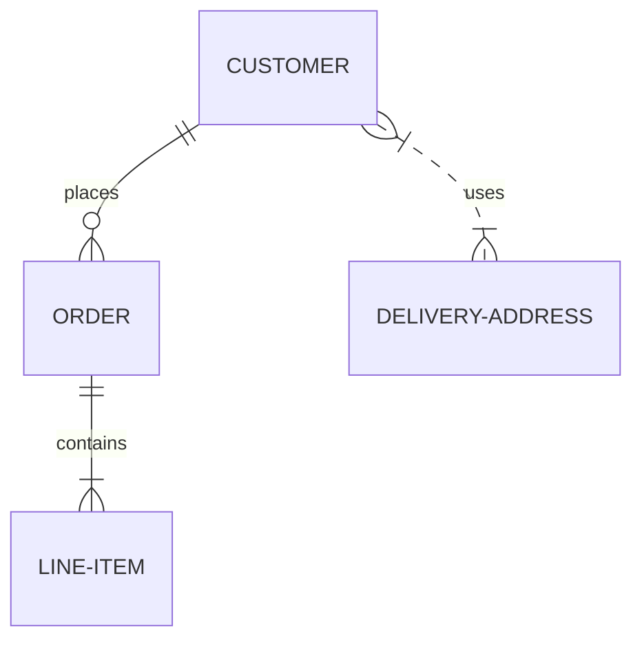

#SQL
# RDB - Řízení databází

## Zápočet
Projekt ve skupině až 3 lidí.

## Zkouška
Na papír, praktický návrh Databáze (SQL).

## Poznámky
> P2P - Peer to Peer (Torrent), když máte hodně nodů a vy jich máte, tak to nejde zničit.
> - Roman Špánek

Školní databáze
RDB2024_JmenoPrijmeni
### DDL
