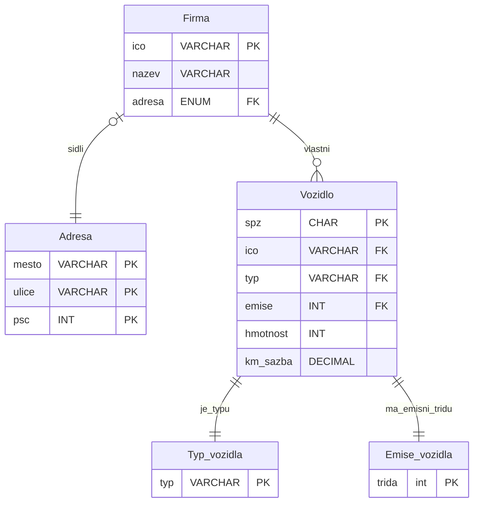

# Zadání semestrální práce RDB 2024

1. Vytvořte databázi, která bude ukládat a zpracovávat data z mýtných bran.
2. Systém eviduje pro každé vozidlo seznam průjezdů v podobně JSON souboru následujícího formátu:

```json
data_prujezdu: {
	brana_id : "1234",
	typ_brany: "mobilni, staticka, virtualni",
	prujezd : {
		datum_prujezdu: "datetime",
		registrace_vozidla: {
		"vozidlo": { 
			"spz", "typ vozidla", "hmotnost", "emisní třída", "km_sazba"
			},
		"firma": {"nazev", "ico", "adresa"}
		},
	"ujete_km" : "number"
}
```

```json
systemova_data: {
	brana_id : "1234",
	verze_os : "1.23",
	systemovy_datum_cas: "timestamp", {
		virtualni -> 
			GPS: "GPS", 
			presnost: "+/-metry"
		staticka -> 
			napeti: "V", 
			proud: "A"
		mobilni -> 
			misto: "adresa", 
			pozice: "GPS", 
			baterie_typ: "dle typu se stanovuje max pocet cyklu a jmenovite napeti", 
			pocet_cyklu: "10"
		}
}
```
## Pro každou registraci vozidla ukládáme:
- kredit (Kč), 
- historie plateb (typ platby (karta (číslo karty, planost, vlastník) | převod (číslo účtu, kód banky) | hotovost), datum platby, kredit)).   
## Připravte:
1. Odpovídající databázové schéma pro relační databázi.
2. Jednoduchý způsob vložení nové registrace a plateb (UI, konzole, import dat).
3. V relační databázi uložte strukturovaná data.
4. V nosql uložte zdrojová data o průjezdech a systémových dat.
### Funkcionalitu:
1. Výpočet zbývajícího kreditu na základě ujetých km (vypočtených dle ujetých vzdáleností mezi bránami).
2. Aktualizace záznamu vozidla, pokud přijde jiná hodnota v JSON
3. Vytvořit report o průjezdu vozidla v rámci stanovených dnů (celkový počet km, celková cena + plný formátovaný (ne JSON) export průjezdů bran z nosql databáze.
## Další:
Pro relační databázi, je třeba použít [https://liquibase.org/](https://liquibase.org/), pro případné změny ve schématu databáze.

Data budou generována pomocí offline generátoru (napsaný v C).
## Poznámky k zadání

### Vygenerovaná data
Vygenerovat 1000ce záznamů.
Testování korektnosti dat na vstupu.

Systémová data
Chodí nám všechny správné atributy?
- špatné zahodit, zalogovat.

### Funkcionalita
Podle počtu ujetých kilometrů jsme schopni určit zůstatek na účtu.
- Berou se aktuální hodnoty po všech změnách.

Update záznamů podle dat v JASON. 

Export z JASON do "reportu" čitelného pro člověka `.txt`. 

Emisní třída a kilometrová sazba musí nějak dávat smysl, nesmí se lišit.
- aktualizace všech záznamů!

Hodnoty číselníků:
Nová hmotnost auta se přidá do číselníku (triger).

Firma může mít více vozidel.
Vozidlo má jen jednu firmu.

> [!question] Jak udělat tabulku, která se liší v atributech?
Nijak, uděláme více tabulek.
## DBs
2 databáze:
- SQL, 
- NoSQL.

Do NoSQL ukládáme všechna zdrojová data (JSON). 
- Ujeté kilometry počítáme z NoSQL. 
Do SQL ukládáme strukturovaná data. 
- Registrace. 

liquibase - git pro relační databáze. Použít při návrhu. Přidávat tabulky postupně. Dá se použít jako plugin do Javy.
### SQL:
- MySQL
- MSSQL
- Postgre <-

Firmy a Auta v konzistentním stavu.

Platby konzistentní:
Týkají se vždy vozidla.

`spz` : CHAR()
typ vozidla: osobní/nákladní, enum
adresa: formát je na nás
- Enum na města dle seznamu?
- Vyhledávání v seznamu statistické dtb

Omezit všechny možné domény atributů.
- ENUM pomocí pomocné tabulky pouze s klíčí. 
- On update cascade 
	- cascading reference integrity

Emisní třída určuje tarif na kilometr.
- `km_sazba` určuje koef tarifu

`hmotnost` : číslo

### ER diagram
Lze použít online:
- [DB_diagram](https://dbdiagram.io/home)
- [Vertabelo](https://vertabelo.com/)
- [Mermaid](https://mermaid.js.org/syntax/entityRelationshipDiagram.html)



### NoSQL:
- MongoDB

Dovedeme dotaz mezi dvě dokumentama?

## Odevzdání

Prezentace a demonstrace aplikace: 12. týden.
- Prezentace 5. slidů, 10 minut max.
- Co a jak funguje

Odevzdání na našem počítači. Nasazení je jedno. 


## TODO:
Django - Python

@Nikita
Docker:
- [ ] Mongo
- [ ] Postgre
- [ ] Aplikace

@Máša
Frontend
- [ ] Přihlášení do Aplikace na Firmu, admina
- [ ] Vizualizace datb z DB
	- Výpočet zůstatku kreditu pro jednotlivá auta
- [ ] Nabíjení kreditu
	- Firma, auto, kredit

@Jarda
Ochočit generátor, bash streamování dat na API.
- [ ] Generátor -> JSON -> Bash na API
- [ ] Parsování a validace příchozích dat
	- [ ] Ukládání do NoSQL
	- [ ] Validace vstupních dat
		- [ ] Generování logu, @Nikita
		- [ ] Ukládání validních dat do Postgre


- [ ] Jak se naučit Django snadno a rychle @Jarda, @Nikita