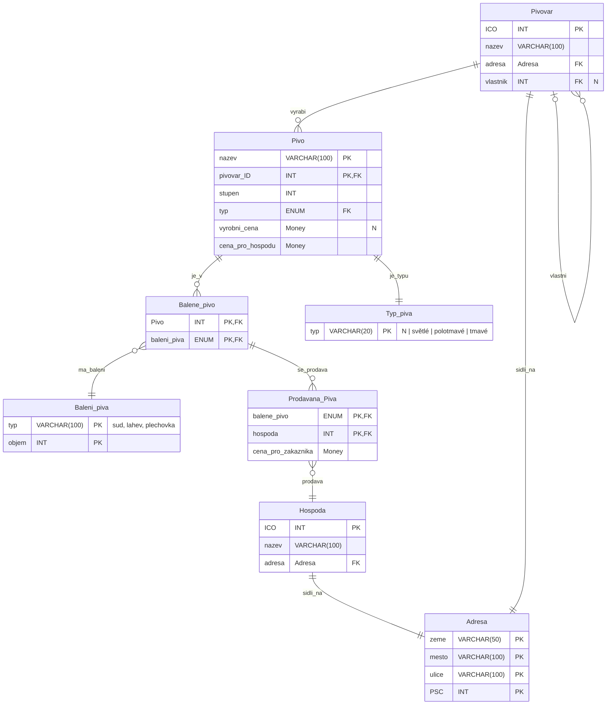

# Pivovary
Pivovar vaří Piva
Pivo čepují v Hospodách
Adresa

> [!note] Pivovary

```mermaid
erDiagram
    Pivovar {
	    ICO INT PK
        nazev VARCHAR(100)
        adresa Adresa FK
        vlastnik INT FK "N"
    }
    
    Pivo {
        nazev VARCHAR(100) PK
        pivovar_ID INT PK, FK
        stupen INT
        typ ENUM FK 
        vyrobni_cena Money "N"
        cena_pro_hospodu Money
    }

    Balene_pivo {
		Pivo INT PK, FK
		baleni_piva ENUM PK, FK
    }

	Typ_piva {
		typ VARCHAR(20) PK "N | světlé | polotmavé | tmavé"
	}

	Baleni_piva {
		typ VARCHAR(100) PK "sud, lahev, plechovka"
		objem INT PK
	}
    
    Hospoda {
	    ICO INT PK
        nazev VARCHAR(100)
        adresa Adresa FK
    }

	Prodavana_Piva {
        balene_pivo ENUM PK, FK
		hospoda INT PK, FK
		cena_pro_zakaznika Money
	}

	Adresa {
        zeme VARCHAR(50) PK
        mesto VARCHAR(100) PK
        ulice VARCHAR(100) PK
        PSC INT  PK
    }

    Pivovar ||--o{ Pivo : vyrabi
    Pivovar ||--|| Adresa : sidli_na
    Pivovar |o--o{ Pivovar : vlastni
    Hospoda ||--|| Adresa : sidli_na
    Pivo ||--o{ Balene_pivo : je_v
    Pivo ||--|| Typ_piva : je_typu
    Balene_pivo }o--|| Baleni_piva : ma_baleni
    Balene_pivo ||--o{ Prodavana_Piva : se_prodava
    Prodavana_Piva }o--|| Hospoda : prodava
```

