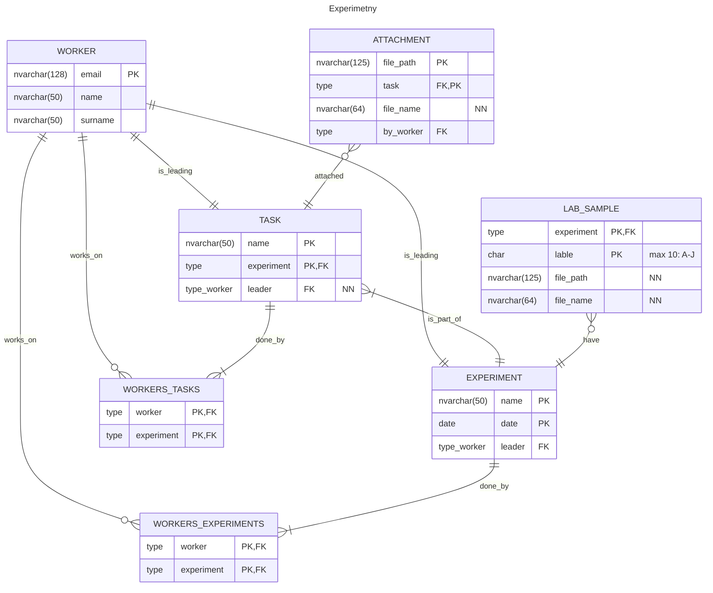

# Správa experimentů
1. Navrhněte DB schéma, které bude zachycovat správu experimentů, na kterých pracují zaměstnanci. Každý může pracovat na libovolném počtu experimentů, na experimentu pracuje více zaměstnanců. Každý experiment vede právě jeden zaměstnanec. Experiment se skládá z více úkolů, minimálně však jednoho a za každý úkol je zodpovědný právě jeden zaměstnanec. Ke každému úkolu může patřit libovolné množství příloh (soubory) a přílohu nahraje právě jeden konkrétní zaměstnanec. Experiment navíc může mít až deset laboratorních vzorků označených A, B, C ... H, I, J. Každé tabulce přidejte mimo primární a cizí klíče další dva libovolné smysluplné atributy. Parcialitu, která nevyplývá ze zadání, zvolte sami a odůvodněte.
2. Navrhněte a odůvodněte pro jednotlivé vztahy omezení referenční integrity.
3. U vybraných dvou entit určete normální formu a pokuste se je upravit tak, abyste normální formu snížili. Uveďte, proč je nižší a odůvodněte pomocí funkčních závislostí.

## Řešení
### Schéma DB

