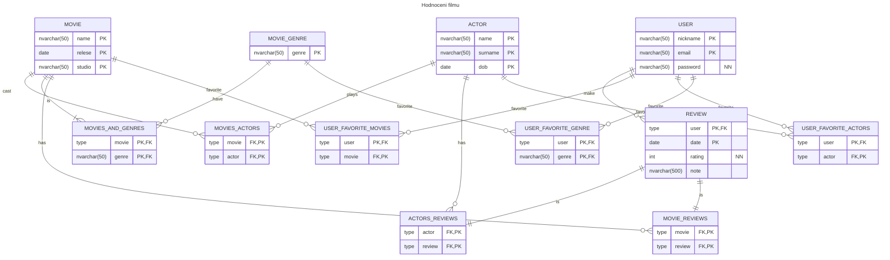

# Hodnocení filmů
1. Navrhněte DB schéma, které bude zachycovat hodnocení filmů uživateli. Každý uživatel hodnotí libovolné filmy a každý film může být hodnocen mnoha uživateli a dokonce několikrát tím stejným uživatelem. U filmů chceme evidovat, jací v nich hrají herci. I pro ně chceme pro jednotlivé filmy ukládat uživatelská hodnocení. Každý film může patřit do několika žánrů, ale vždy alespoň jednoho. Uživatel si může zvolit své oblíbené žánry, herce a filmy. Každé tabulce přidejte mimo primární a cizí klíče další dva libovolné smysluplné atributy. Parcialitu, která nevyplývá ze zadání, zvolte sami a odůvodněte.
2. Navrhněte a odůvodněte pro jednotlivé vztahy omezení referenční integrity.
3. U vybraných dvou entit určete normální formu a pokuste se je upravit tak, abyste normální formu snížili. Uveďte, proč je nižší a odůvodněte pomocí funkčních závislostí.

## Řešení
### Schéma DB

### Normální formy
