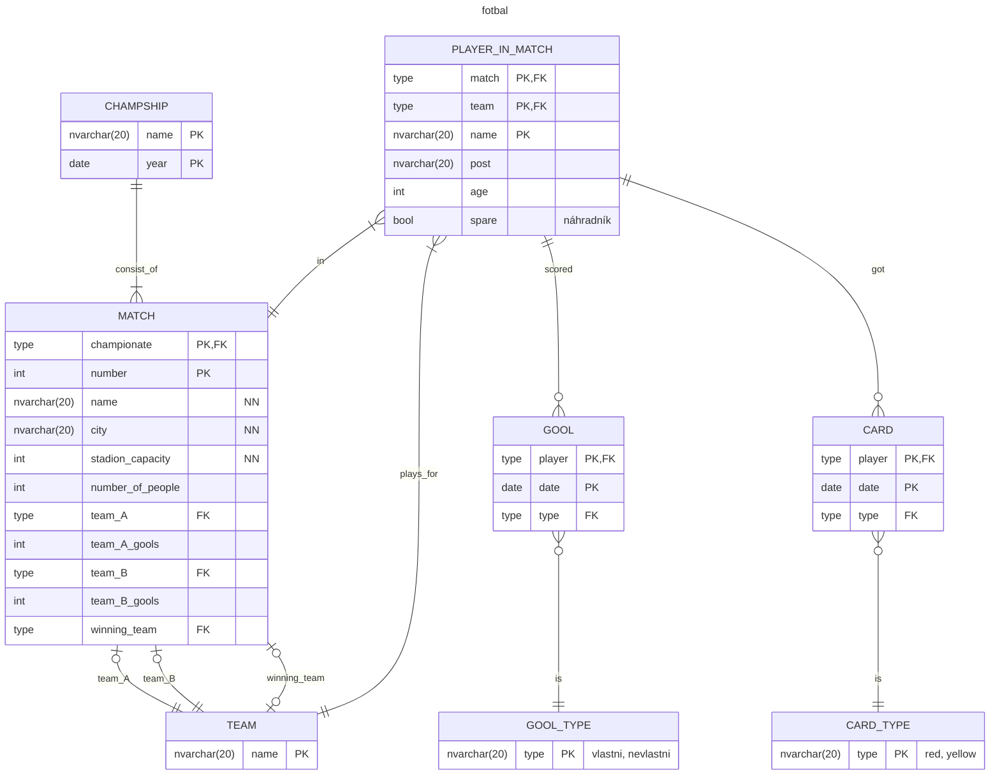

# ME ve fotbale
## Zadání
Navrhněte schéma pro databázi ME ve fotbale. 

Zápasy mistrovství se hrají na stadionech s různou kapacitou v různých městech. Každý zápas má své pořadové číslo v rámci celého šampionátu. U odehraného zápasu se kromě výsledného skóre a návštěvnosti zaznamenává, kdo dal góly a kdo dostal žlutou nebo červenou kartu. Ke každému zápasu existuje soupiska hráčů a náhradníků dvou týmů. U hráče v týmu se eviduje jméno, post, na kterém hraje, a věk. Pokud v zadání chybí nějaká informace, napište do zadání věty, které ho o tuto informaci doplní, a pak upravte schéma.  
## Řešení
### Schéma DB

### Normální formy

V tabulce MATCH:
championate & number -> name & teamy
championate !-> city & stadion_capacity
number ->  city & stadion_capacity

Stadion není závislý na celém klíči, proto je tabulka jen v 1. NF.

Počet gólu je uložený jako duplicitní informace:
- jednak v zápasu,
- pak pro jednotlivé hráče, kteří je skórovali.

Slouží to v budoucnu pro kontrolu že se součty sedí a také při výpisu souhrnu informací o zápasu do šetří dost joinů na hráče a góly. 

Hráč je zde uložen pouze jako jméno v tabulce hráči v zápasech. Pro mnoho zápasů se tak tyto jména budou často opakovat. V budoucnu by bylo lepší vytvořit hráče jako samostatnou tabulku a ukládat u něj datum narození, ze kterého půjde vypočítat kolik mu v době daného turnaje bylo.