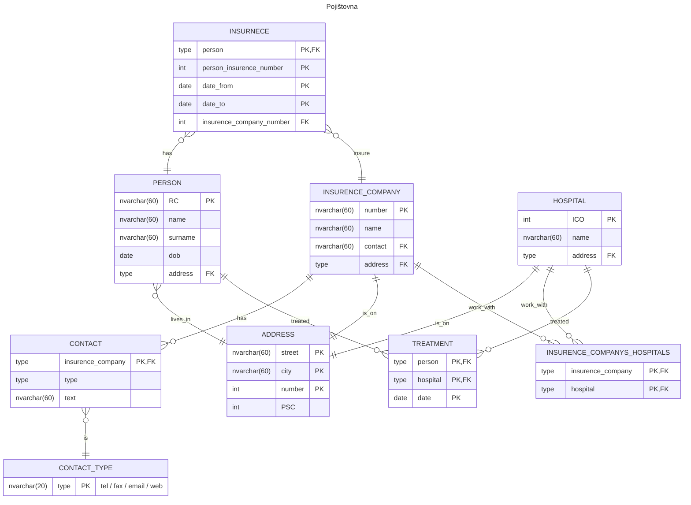

# Pojišťovna
## Zadání
V jaké normální formě je relace: 
POJISTENEC(jméno, příjmení, RC, datum_narození, adresa, pojišťovna_kod, pojišťovna_název, pojišťovna_sídlo, pojišťovna_kontakty, smluvní_nemocnice_název, smluvní_nemocnice_sídlo, smluvní_nemocnice_ičo). 

Upravte relaci, aby byla v odpovídající NF, popište postup normalizace.
- Platí, že pacient může v životě mít více pojišťoven. 
- Udržujte informaci o tom, kdy měl jakou pojišťovnu. 
- Pojišťovna má několik různých kontaktů (tel, fax, email, weby) a každá může mít jiné kontakty (typy). 
- Pojišťovna má také nasmlouvány nemocnice s nimiž spolupracuje (obecně jich může být více a jedna nemocnice může být smluvní partnerem více pojišťoven).

Navrhněte, jaký byste použili index pro následující atributy:
- Atribut, který je minimálně aktualizován, nabývá malého množství různých hodnot
- Atribut, který je velmi často modifikován
- Atribut, který je průměrně modifikován a je nutné velmi rychlé vyhledávaní podle jeho hodnot, nabývá velkého množství hodnot
 
Navrhněte trigger, který bude kontrolovat, že daná nemocnice má smlouvu s pojišťovnou pacienta (při pokusu o vložení/aktualizaci tabulky ošetření (pojištěnec, nemocnice)) a pokud nemá, tak má založit nový záznam do tabulky žádosti (pojištěnec, nemocnice, datum_zadosti).

Napište SQL, které vybere všechny pojištence, kteří navštívili nemocnice v Liberci a Praze a přitom neměli nikdy pojištění u VZP nebo VP a jejichž datum narozeni je větší než u všech pojištěnců co se jmenují Petr Novák.

Jaké znáte stupně izolace u transakcí, jaký byste použili, pokud byste měli realizovat bankovní transakce z jednoho účtu na druhý (kdy budeme převádět celý zůstatek).
## Postup řešení
### Shéma DB
Nejsou v žádné normální formě.

Pojištěnec(J, P, PK:RC, DN, A)

Adresa(U, C, M)

Pojišťovna(PK:K, N, SP, Kontakt)

Kontakt(Hodnota, Typ)

Typy(Typ)
- omezení domény atributů

Nemocnice(PK:ICO, N, S-> Adresa)

Pojištenec_Pojištovna(PK:ČP, PK:Pojištenec, PK:Datum)
Od, do



Přidána je tabulka TREATMENT, která implicitně říká kdo byl kde hospitalizován.
### Indexy
| index                   | požadavky                                                                                                                     |
| ----------------------- | ----------------------------------------------------------------------------------------------------------------------------- |
| bitmapa                 | Atribut, který je minimálně aktualizován, nabývá malého množství různých hodnot.                                              |
| B+ strom  neclustrovaný | Atribut, který je velmi často modifikován.                                                                                    |
| B+ strom clustrovaný    | Atribut, který je průměrně modifikován a je nutné velmi rychlé vyhledávaní podle jeho hodnot, nabývá velkého množství hodnot. |
### Triggery
> Navrhněte trigger, který bude kontrolovat, že daná nemocnice má smlouvu s pojišťovnou pacienta (při pokusu o vložení/aktualizaci tabulky ošetření (pojištěnec, nemocnice)) a pokud nemá, tak má založit nový záznam do tabulky žádosti (pojištěnec, nemocnice, datum_zadosti).

```SQL
CREATE TRIGGER check_insurance_contract
ON ošetření
AFTER INSERT, UPDATE 
AS 
BEGIN
    -- Provedení ověření pro každý nový nebo aktualizovaný záznam
    IF EXISTS (
        SELECT 1
        FROM inserted AS i
        JOIN nemocnice AS n ON i.nemocnice = n.nemocnice_id
        JOIN pojišťovny AS p ON i.pojišťovna = p.pojišťovna_id
        WHERE NOT EXISTS (
            SELECT 1
            FROM smlouvy
            WHERE smlouva_nemocnice = n.nemocnice_id
            AND smlouva_pojišťovna = p.pojišťovna_id
        )
    )
    BEGIN
        -- Pokud nemocnice nemá smlouvu, vložit záznam do tabulky žádosti
        INSERT INTO žádosti (pojištěnec, nemocnice, datum_zadosti)
        SELECT i.pojištěnec, i.nemocnice, GETDATE()
        FROM inserted AS i
        JOIN nemocnice AS n ON i.nemocnice = n.nemocnice_id
        JOIN pojišťovny AS p ON i.pojišťovna = p.pojišťovna_id
        WHERE NOT EXISTS (
            SELECT 1
            FROM smlouvy
            WHERE smlouva_nemocnice = n.nemocnice_id
            AND smlouva_pojišťovna = p.pojišťovna_id
        );
    END;
END;
```

### SQL dotaz
> Napište SQL, které vybere všechny pojištence, kteří navštívili nemocnice v Liberci a Praze a přitom neměli nikdy pojištění u VZP nebo VP a jejichž datum narozeni je větší než u všech pojištěnců co se jmenují Petr Novák.

```SQL
SELECT person.RC, person.name FROM (
	-- starsi nez Petr Novak
	SELECT RC FROM PERSON
	WHERE DOB > (
		SELECT MAX(DOB) FROM PERSON
		WHERE name = 'Petr' AND surname = 'Novák';
	)
) as person, (
	-- osetreni v Liberci i Praze
	SELECT DISTINCT treatment_in_liberec.person FROM (
		SELECT TREATMENT.person FROM TREATMENT, HOSPITAL, ADDRESS
		WHERE TREATMENT.hospital = HOSPITAL.ICO
		AND HOSPITAL.address = ADDRESS.address
		AND ADDRESS.city = "Liberec"
	) as treatment_in_liberec, (
		SELECT TREATMENT.person FROM TREATMENT, HOSPITAL, ADDRESS
		WHERE TREATMENT.hospital = HOSPITAL.ICO
		AND HOSPITAL.address = ADDRESS.address
		AND ADDRESS.city = "Praha"
	) as treatment_in_prague
	WHERE treatment_in_liberec.person = treatment_in_prague.person
) as treatment, (
	-- Nebyli ani u VZP ani VP (vsichni minus (VZP a VP))
	SELECT RC FROM PERSON -- vsichni
	EXCEPT -- mnozinove odecteni
	SELECT DISTINCT RC FROM INSURENCE, INSURENCE_COMPANY
	WHERE INSURENCE.insurence_company_number = INSURENCE_COMPANY.number
	AND INSURENCE_COMPANY.name IN ('VZP', 'VP'); -- jsou u VZP nebo VP
) as insured
WHERE person.RC = treatment.RC
AND person.RC = insured.RC
```

### Transakce
> Jaké znáte stupně izolace u transakcí, jaký byste použili, pokud byste měli realizovat bankovní transakce z jednoho účtu na druhý (kdy budeme převádět celý zůstatek).

Stupně izolací:
- READ UNCOMMITTED
- READ COMMITTED
- REPEATABLE READ
- SERIALIZABLE

REPEATABLE READ - blokuje záznamy do skončení transakce.