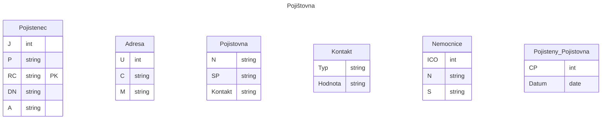

# Pojišťovna
## Zadání
V jaké normální formě je relace: 
POJISTENEC(jméno, příjmení, RC, datum_narození, adresa, pojišťovna_kod, pojišťovna_název, pojišťovna_sídlo, pojišťovna_kontakty, smluvní_nemocnice_název, smluvní_nemocnice_sídlo, smluvní_nemocnice_ičo). 

- Platí, že pacient může v životě mít více pojišťoven. 
- Udržujte informaci o tom, kdy měl jakou pojišťovnu. 
- Pojišťovna má několik různých kontaktů (tel, fax, email, weby) a každá může mít jiné kontakty (typy). 
- Pojišťovna má také nasmlouvány nemocnice s nimiž spolupracuje (obecně jich může být více a jedna nemocnice může být smluvní partnerem více pojišťoven).
- Upravte relaci, aby byla v odpovídající NF, popište postup normalizace.

Navrhněte, jaký byste použili index pro následující atributy:
- Atribut, který je minimálně aktualizován, nabývá malého množství různých hodnot
- Atribut, který je velmi často modifikován
- Atribut, který je průměrně modifikován a je nutné velmi rychlé vyhledávaní podle jeho hodnot, nabývá velkého množství hodnot
 
Navrhněte trigger, který bude kontrolovat, že daná nemocnice má smlouvu s pojišťovnou pacienta (při pokusu o vložení/aktualizaci tabulky ošetření (pojištěnec, nemocnice)) a pokud nemá, tak má založit nový záznam do tabulky žádosti (pojištěnec, nemocnice, datum_žádosti).

Napište SQL, které vybere všechny pojištence, kteří navštívili nemocnice v Liberci a Praze a přitom neměli nikdy pojištění u VZP nebo VP a jejichž datum narozeni je větší než u všech pojištěnců co se jmenují Petr Novák.

Jaké znáte stupně izolace u transakcí, jaký byste použili, pokud byste měli realizovat bankovní transakce z jednoho účtu na druhý (kdy budeme převádět celý zůstatek).
## Postup řešení

Pojištěnec(J, P, PK:RC, DN, A)

Adresa(U, C, M)

Pojišťovna(PK:K, N, SP, Kontakt)

Kontakt(Hodnota, Typ)

Typy(Typ)
- omezení domény atributů

Nemocnice(PK:ICO, N, S-> Adresa)

Pojištenec_Pojištovna(PK:ČP, PK:Pojištenec, PK:Datum)
Od, do

