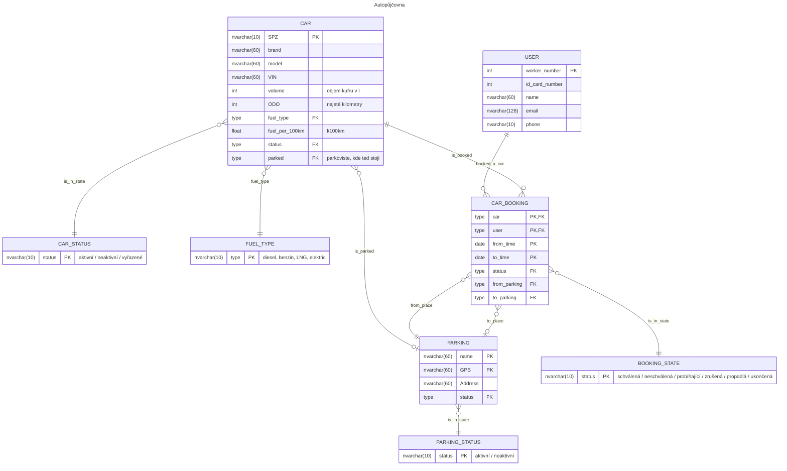

# Autopůjčovna
## Zadání
Navrhněte schéma pro databázi podnikové autopůjčovny. 

Uživatelé, u nichž evidujeme jméno, telefon, zaměstnanecké číslo, e-mail a číslo zaměstnanecké karty, si v určitý časový interval, který předem zadají, půjčují auta. 
U aut potřebujeme znát značku, model, obsah, registrační značku (SPZ), vin, spotřebu, druh paliva, aktuální najeté kilometry (ODO) a stav (aktivní / neaktivní / vyřazené). 

Auto si uživatel půjčí na vybraném parkovišti a na jakémkoli z možných parkovišť auto vrátí (na tom samém nebo na jiném). Parkoviště má svůj název, GPS souřadnice vjezdu, adresu a stav (aktivní / neaktivní). O dané výpůjčce musíme vědět, v jakém je aktuálně stavu (schválená / neschválená / probíhající / zrušená / propadlá / ukončená). Pokud v zadání chybí nějaká informace, napište do zadání věty, které ho o tuto informaci doplní, a pak upravte schéma.

## Řešení
Obsah motoru nebo kufru?
### Schéma DB

Z posledního bookingu by bylo možné zjistit kde auto stojí, ale pro snadnější hledání aut na parkovištích a servisní převoz aut je u každého auta uložené na kterém parkovišti je zrovna zaparkované.

Adresa parkoviště je jen doplňková informace, očekává se že zákazník použije GPS souřadnice pro přesnou lokalizaci. Proto je adresa uložené jako jeden atribut.