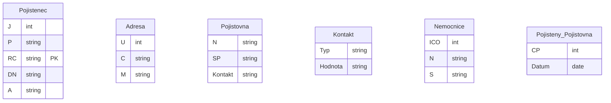

# Návrh DB - zadání k procvičení

## 1. Příklad
Navrhněte schéma pro databázi podnikové autopůjčovny. 

Uživatelé, u nichž evidujeme jméno, telefon, zaměstnanecké číslo, e-mail a číslo zaměstnanecké karty, si v určitý časový interval, který předem zadají, půjčují auta. 
U aut potřebujeme znát značku, model, obsah, registrační značku (SPZ), vin, spotřebu, druh paliva, aktuální najeté kilometry (ODO) a stav (aktivní / neaktivní / vyřazené). 

Auto si uživatel půjčí na vybraném parkovišti a na jakémkoli z možných parkovišť auto vrátí (na tom samém nebo na jiném). Parkoviště má svůj název, GPS souřadnice vjezdu, adresu a stav (aktivní / neaktivní). O dané výpůjčce musíme vědět, v jakém je aktuálně stavu (schválená / neschválená / probíhající / zrušená / propadlá / ukončená). Pokud v zadání chybí nějaká informace, napište do zadání věty, které ho o tuto informaci doplní, a pak upravte schéma.
## 2. Příklad

Navrhněte schéma pro databázi ME ve fotbale. 

Zápasy mistrovství se hrají na stadionech s různou kapacitou v různých městech. Každý zápas má své pořadové číslo v rámci celého šampionátu. U odehraného zápasu se kromě výsledného skóre a návštěvnosti zaznamenává, kdo dal góly a kdo dostal žlutou nebo červenou kartu. Ke každému zápasu existuje soupiska hráčů a náhradníků dvou týmů. U hráče v týmu se eviduje jméno, post, na kterém hraje, a věk. Pokud v zadání chybí nějaká informace, napište do zadání věty, které ho o tuto informaci doplní, a pak upravte schéma.  

## Pojišťovna
### Zadání
V jaké normální formě je relace: 
POJISTENEC(jméno, příjmení, RC, datum_narození, adresa, pojišťovna_kod, pojišťovna_název, pojišťovna_sídlo, pojišťovna_kontakty, smluvní_nemocnice_název, smluvní_nemocnice_sídlo, smluvní_nemocnice_ičo). 

- Platí, že pacient může v životě mít více pojišťoven. 
- Udržujte informaci o tom, kdy měl jakou pojišťovnu. 
- Pojišťovna má několik různých kontaktů (tel, fax, email, weby) a každá může mít jiné kontakty (typy). 
- Pojišťovna má také nasmlouvány nemocnice s nimiž spolupracuje (obecně jich může být více a jedna nemocnice může být smluvní partnerem více pojišťoven).
- Upravte relaci, aby byla v odpovídající NF, popište postup normalizace.

Navrhněte, jaký byste použili index pro následující atributy:
- Atribut, který je minimálně aktualizován, nabývá malého množství různých hodnot
- Atribut, který je velmi často modifikován
- Atribut, který je průměrně modifikován a je nutné velmi rychlé vyhledávaní podle jeho hodnot, nabývá velkého množství hodnot
 
Navrhněte trigger, který bude kontrolovat, že daná nemocnice má smlouvu s pojišťovnou pacienta (při pokusu o vložení/aktualizaci tabulky ošetření (pojištěnec, nemocnice)) a pokud nemá, tak má založit nový záznam do tabulky žádosti (pojištěnec, nemocnice, datum_žádosti).

Napište SQL, které vybere všechny pojištence, kteří navštívili nemocnice v Liberci a Praze a přitom neměli nikdy pojištění u VZP nebo VP a jejichž datum narozeni je větší než u všech pojištěnců co se jmenují Petr Novák.

Jaké znáte stupně izolace u transakcí, jaký byste použili, pokud byste měli realizovat bankovní transakce z jednoho účtu na druhý (kdy budeme převádět celý zůstatek).
### Postup řešení

Pojištěnec(J, P, PK:RC, DN, A)

Adresa(U, C, M)

Pojišťovna(PK:K, N, SP, Kontakt)

Kontakt(Hodnota, Typ)

Typy(Typ)
- omezení domény atributů

Nemocnice(PK:ICO, N, S-> Adresa)

Pojištenec_Pojištovna(PK:ČP, PK:Pojištenec, PK:Datum)
Od, do

