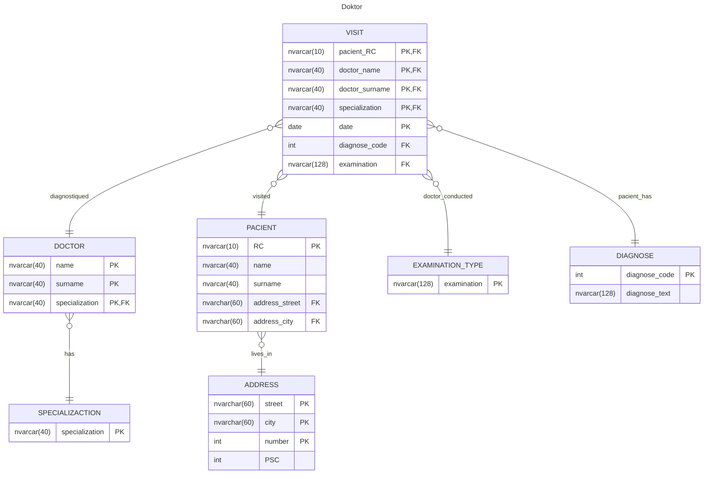

# Lékař
> RDB 2014 ZK - Špánek - 2. termín

1) Normalizujte databázi pro ukládání návštěv u lékaře.
Máme uchovávat:
pacient_rč, pacient_jmeno, pacient_prijmeni, pacient_adresa, lekar_jmeno, lekar_prijmeni, lekar_specializace, kod_diagnozy, diagnoza, typ_vysetreni, datum_navstevy

Vtvořte ERD diagram s tabulkami v optimální NF splňující:
- každý pacient může navštěvovat, více doktorů,
- budeme v budoucnu chtít vyhledávat pacienty dle města atd...,
- každá návštěva má jednu diagnózu a jeden typ vyšetření...koukne do krku => chřipka,
- každý doktor má jednu specializaci,
- každá diagnóza je jedinečná, mela by mít jedinečný kód,
- do relace pro uchovaní návštěv je zadáván kód diagnózy a vyšetřeni, který doktor, komu a kdy ji diagnostikoval.

2) SQL příkaz, který vybere pacienty, kterým byla diagnostikovaná chřipka nebo diabetes, a kteří nikdy nebyli u ortopeda nebo u doktora se specializací ORL.
3) Trigger pro automatické ukládání kódu nemoci u návštěv.
doktor vloží do záznamu název nemoce (třeba chřipka). je zkontrolováno zda je tato nemoc v tabulce s nemocemi a má definovaný kód, pokud ano tak využije její kod.
Pokud ne, nejdříve ji přidá k nemocem a vytvoří kód pak tento kód využije.
kód může být řešen přes autoincrement.. nemusíme řešit jeho strukturu
4) Jaký index byste použili při urychlení práce s tabulkou uchovávající pohlaví.
5) U čeho řešíme IZOLACE a jaké známe.
## Postup řešení
### Shéma DB

### SQL
> SQL příkaz, který vybere pacienty, kterým byla diagnostikovaná chřipka nebo diabetes, a kteří nikdy nebyli u ortopeda nebo u doktora se specializací ORL.
```SQL
SELECT PACIENT.RC, name, surname FROM PACIENT, (
	SELECT DISTINCT VISIT.pacient_RC AS RC FROM VISIT, DIAGNOSE
	WHERE VISIT.diagnose_code = DIAGNOSE.diagnose_code
	AND DIAGNOSE.diagnose_text IN ("chřipka", "diabetes")
) AS not_illnes, (
	SELECT PACIENT.RC FROM PACIENT
	EXCEPT
	SELECT DISTINCT VISIT.pacient_RC AS RC FROM VISIT, DOCTOR
	WHERE VISIT.doctor = DOCTOR -- TODO
	AND DOCTOR.specialization in ("specialization", "ORL")
) AS not_doctor_type
WHERE PACIENT.RC = not_illnes.RC
AND PACIENT.RC = not_doctor_type.RC
```
### Trigger
```SQL
CREATE TRIGGER assign_disease_code
ON návštěvy
AFTER INSERT
AS
BEGIN
    -- Získání nově vložené návštěvy
    DECLARE @disease NVARCHAR(100);
    SELECT @disease = inserted.nemoc
    FROM inserted;

    -- Zkontrolovat, zda nemoc existuje v tabulce nemoci a má definovaný kód
    DECLARE @disease_code INT;
    SELECT @disease_code = kod_nemoci
    FROM nemoci
    WHERE nazev_nemoci = @disease;

    -- Pokud nemoc neexistuje nebo nemá definovaný kód, přidat ji a vytvořit kód
    IF @disease_code IS NULL
    BEGIN
        -- Přidat nemoc do tabulky nemoci
        INSERT INTO nemoci (nazev_nemoci)
        VALUES (@disease);

        -- Získat nově vytvořený kód nemoci
        SELECT @disease_code = SCOPE_IDENTITY();

        -- Aktualizovat záznam návštěvy s novým kódem nemoci
        UPDATE návštěvy
        SET kod_nemoci = @disease_code
        FROM návštěvy
        WHERE nemoc = @disease;
    END
    ELSE
    BEGIN
        -- Aktualizovat záznam návštěvy s existujícím kódem nemoci
        UPDATE návštěvy
        SET kod_nemoci = @disease_code
        FROM návštěvy
        WHERE nemoc = @disease;
    END
END;
```
### Index
Sloupec pohlaví bude mít malý počet hodnot, které bude nabývat a bude se jen zřídka měnit.
Použil bych bitmapu.
### Transakce

Izolace řešíme u transakcí rozlišujeme:
- čtení nepotvrzených změn,
- čtení jen potvrzených změn,
- blokaci zpracovávaných řádků, dokud neskončí transakce.
- blokaci proti vkládání nových řádků, dokud neskončí transakce.